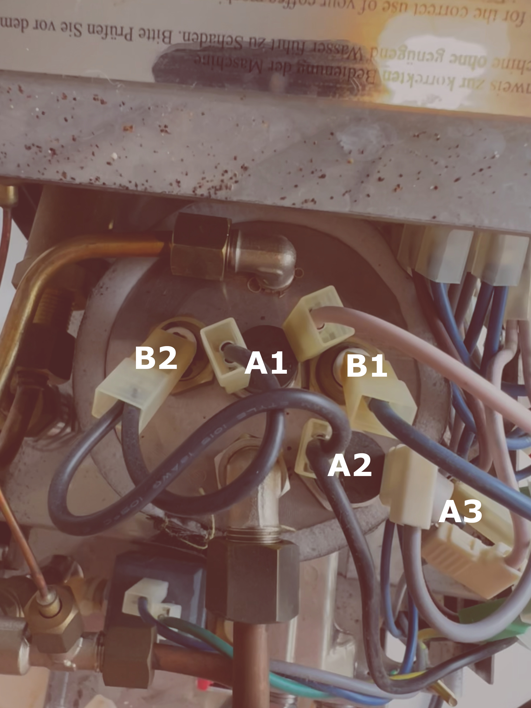

# Investigations

## Understanding the machine

The first task is to understand the ECM Casa IV, as I have found few online guides on this particular machine.
It's rather easy to take apart, with one large sheet covering the entire back and sides of the machine.

<figure markdown="span">
  
  <figcaption>Boiler pinout</figcaption>
</figure>

<figure markdown="span">
  
  <figcaption>Diagram of heater part of circuit.</figcaption>
</figure>

The heater circuit is quite simple, despite requiring some investigation to understand what's what.
As far as I understand, there are three bimetallic disc thermostats regulating the circuit - labelled A1, A2, A3 in the diagram[^name-note].
A1 and A2 are in parallel, with A2 in series with the steam switch.
My guess is A1 is the brew thermostat and A2 is the steam thermostat.
A3 is in series with the rest, and so probably a safety switch?
I did not investigate it more, but either it is an extra thermal switch, or maybe a switch not notice a dry boiler?

[^name-note]: Why the A, and not T or BDT? Well, when I started, I had no idea what they were, so I simply labeled them A, and the other type of mounts B. Luckily that proved to be the boiler, so the B was a good fit.

A1 and A2 seem to be screwed in with M4 threads.
The first step is probably to get hold of an M4 thermostat probe, and see what temperatures we measure.
