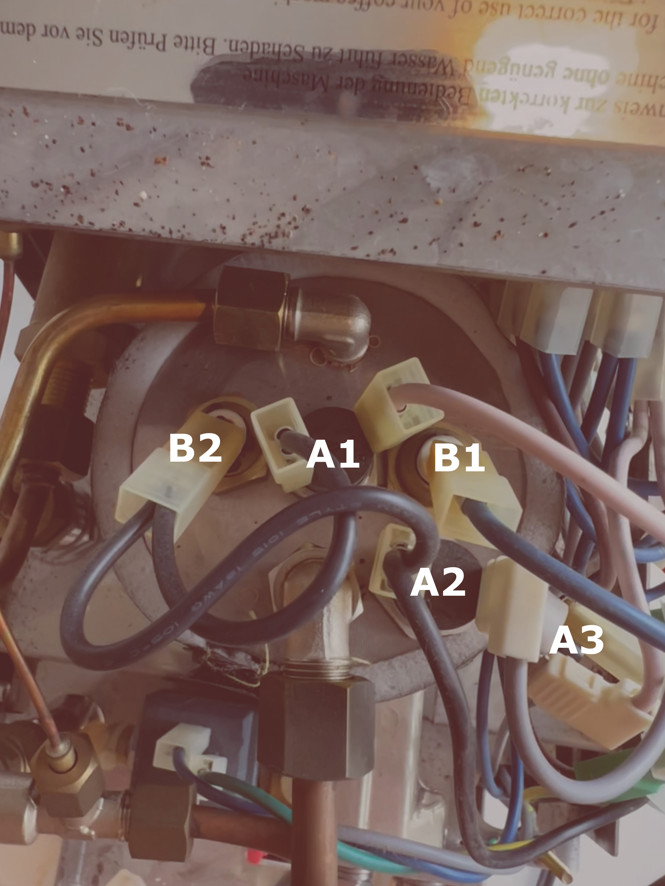

# Investigations

## Understanding the machine

The first task is to understand the ECM Casa IV, as I have found few online guides on this particular machine.
It's rather easy to take apart, with one large sheet covering the entire back and sides of the machine.

<figure markdown="span">
  
  <figcaption>Boiler pinout</figcaption>
</figure>

<figure markdown="span">
  
  <figcaption>Diagram of heater part of circuit.</figcaption>
</figure>

The heater circuit is quite simple, despite requiring some investigation to understand what's what.
As far as I understand, there are three bimetallic disc thermostats regulating the circuit - labelled A1, A2, A3 in the diagram[^name-note].
A1 and A2 are in parallel, with A2 in series with the steam switch.
My guess is A1 is the brew thermostat and A2 is the steam thermostat.
A3 is in series with the rest, and so probably a safety switch?
I did not investigate it more, but either it is an extra thermal switch, or maybe a switch not notice a dry boiler?

[^name-note]: Why the A, and not T or BDT? Well, when I started, I had no idea what they were, so I simply labeled them A, and the other type of mounts B. Luckily that proved to be the boiler, so the B was a good fit.

A1 and A2 seem to be screwed in with M4 threads.
The first step is probably to get hold of an M4 thermostat probe, and see what temperatures we measure.

## Ordering parts

Getting a thermocouple proved to be more difficult than expected.
Knowing nothing of temperature sensors from before, I did some research, and found that the best fit is probably a simple K-type thermocouple, with a MAX31855 chip.
It can handle temperatures way beyond what we require, up to 1800°C, all while being quite cheap and precise.
The only issue I saw before ordering, is that the output is rounded to the nearest 0.25°C, which I hoped would not be an issue (spoiler: it was).

I bought a couple of MAX31855s, and also a selection of K-type thermocouples with an M4 thread.

### Not getting the thermocouple to work

The first shipment to arrive, was the MAX31855s.
They came with an M5 thread thermocouple, so I thought I could get started experimenting while waiting for the M4 ones.
However, I could not for the life of me get it to work.
I used the [Adafruit MAX31855 library](https://docs.arduino.cc/libraries/adafruit-max31855-library/), and hooked everything up like their example.
The cold junction temperature readings seemed reasonable, but the thermocouple readings were all over the place.

The temperature readings were super noisy, ranging from a couple of degrees negative to some hundred degrees positive.
They were also super sensitive to me touching the arduino.
My first suspicion was that my power supply was too noisy, as I was running an old knock-of Arduino Uno, powered from my laptop.
I went and bought a new Arduino with a proper power supply, but the readings were still noisy.
My next suspicion was that the thermocouple was broken, or of the wrong type.
However, the leads were not grounded to the housing, so it was not a grounded type thermocouple.
Also, if it was a different type than K, like J, N, T etc., we would not expect noisy readings, just wrong readings.

So I decided to wait for the M4 thermocouples to arrive, and see if they worked better.
They did not.
So, I went ahead and bought a proper Adafruit MAX31855 breakout board.
And it worked!

## Temperature readings for the stock setup

I disconnected the old steam temperature switch, and installed the thermocouple.
I then put the machine in brew mode, and read out the temperature.
