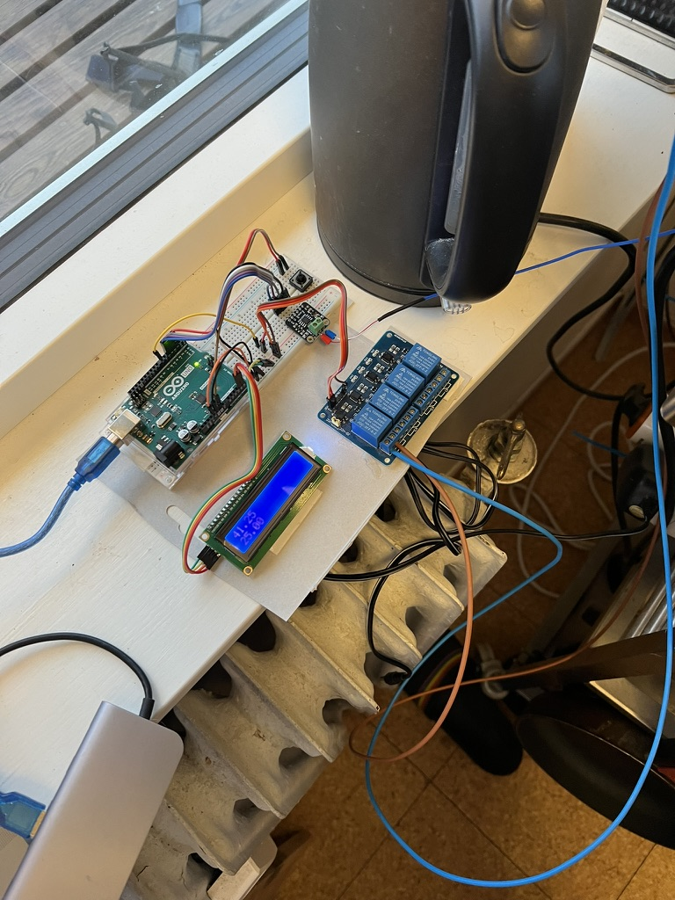
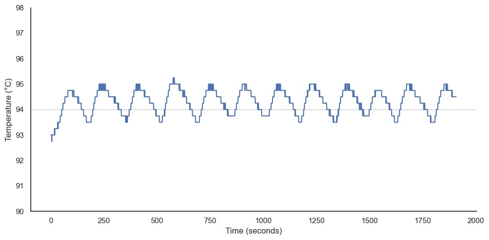

# Making a PID controller for the machine

With the thermocouple installed, an old LCD and relay module I had lying around, and my rusty C++, I made a first simple prototype.



To keep things simple, the first controller only used the P-term.
The relay was controlled using "time proportioning control", which is much better explained by Brett Beauregard in [this example](https://github.com/br3ttb/Arduino-PID-Library/blob/master/examples/PID_RelayOutput/PID_RelayOutput.ino).
Essentially, we decide on some time interval, and then turn the relay on for a percentage of that time.

```C++
if (now - windowStartTime > WindowSize) {
    //time to shift the Relay Window
    windowStartTime += WindowSize;
}

if (Output < now - windowStartTime) {
    digitalWrite(RELAY_PIN, HIGH);
} else {
    digitalWrite(RELAY_PIN, LOW);
}
```

And the results were already much better than the stock setup, with the temperature oscillating within +- 1°C of the setpoint.



## Getting lost in C++

My C++ is quite rusty, and I haven't really made anything complex for an embedded system before.
I decided I wanted to make a nice user interface, to control mode, PID parameters, setpoint, and so on.
So I spent some time making an interface system, getting annoyed with the lack of modern C++ convenience features on the C++, and getting totally lost in abstraction levels.

## The issue of the quantized sensor readings

The MAX31855 outputs the temperature readings rounded to the nearest 0.25°C.
This has a huge impact on our PID controller;
if the PID loop is faster than the time it takes the temperature to change 0.25°C, the difference in the PID loop step is 0.
Then, when it does tick over to the next 0.25°C, the PID controller will see a huge change in the error, and overreact.
Two possible solutions to this are:

- Run a slower PID loop
- Filter the readings
